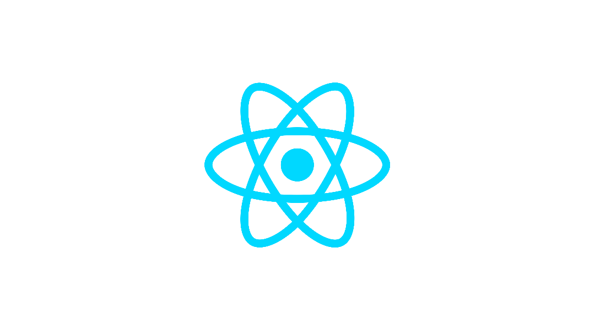
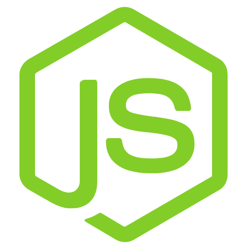

# 📇 Notionary
---
개인의 노션(Notion) 워크스페이스를 공유하고, 게시글을 통해 다양한 고민을 커뮤니티의 힘으로 해결하는 웹사이트

## 📓목차
- [📺 프로젝트 소개](#-프로젝트-소개)
- [🖥 화면 구성](#-화면-구성)
- [📌 메인 페이지](#-메인-페이지)
- [📌 추가 페이지](#-추가-페이지)
- [📌 수정 페이지](#-수정-페이지)
- [🏷️ 주요 기능](#️주요-기능)
- [🗓️ 개발 기간](#️-개발-기간)
- [💁‍♂️ 팀원소개](#️-팀원소개)
- [🛠 기술 스택](#-기술-스택)
- [🛠 협업 도구](#-협업-도구)
- [🛠 프로젝트 폴더 구조 ](#-프로젝트-폴더-구조)
---
## 📺 프로젝트 소개
"Notionary"는 사용자가 게시글을 작성하며 자신의 지식, 경험, 또는 고민을 공유하고, 필요하다면 노션 워크스페이스를 선택적으로 함께 공유할 수 있는 커뮤니티 기반 웹사이트입니다. 사용자들은 서로의 게시글과 워크스페이스를 통해 다양한  아이디어를얻고, 문제 해결을 위한 지혜를 나눌 수 있습니다. 특히, 어려운 고민이 있을 때 커뮤니티의 집단 지성을 활용하여 해결책을 모색하는 것이 Notionary의 핵심 가치입니다.

## 🖥 화면 구성

### 📌 메인 페이지

  
  
  
  

- 공유된 워크스페이스 및 게시글 목록 : 사용자들이 공유한 워크스페이스 정보와 함께 작성된 게시글들이 한눈에 볼 수 있도록 표시됩니다.

- 카테고리별 탐색: 사용자는 특정 카테고리에 해당하는 게시글만 모아서 볼 수 있습니다.

- 댓글 및 좋아요 기능 : 여러 사용자들의 게시글에 댓글과 좋아요를 표시할 수 있습니다.

---
### 📌 추가 페이지

  
  

- 카테고리별 게시글 추가: 게시글의 주제에 맞는 카테고리를 선택하여 게시글을 추가할 수 있습니다.

- 워크스페이스 첨부 (선택 사항): 게시글 작성 시, 자신의 노션 워크스페이스를 선택적으로 첨부할 수 있습니다.

- 미디어 파일 첨부: 이미지, 동영상 등 다양한 미디어 파일을 게시글에 첨부할 수 있습니다.
---
### 📌 수정 페이지

- 게시글 내용 수정: 작성한 게시글의 제목, 내용, 카테고리, 미디어 파일 등을 수정할 수 있습니다.

  

---
## 🏷️주요 기능

* 노션처럼 개인이 작성할 수 있는 워크스페이스 기능

* 게시글의 좋아요 및 댓글 기능

* 게시글에 개인 워크스페이스 첨부 기능 

* 마이페이지에서 사용자가 작성한 게시글 조회 기능

## 🗓️ 개발 기간
* 2025.05.16 ~ 2025.06.1 (총 16일)

### 💁‍♂️ 팀원소개
---

  

     
    <a href="https://github.com/susuholee">팀원 : 이수호</a>
  

  

     
    <a href="https://github.com/Sialsry">팀원 : 김민교</a>
  

  

     
    <a href="https://github.com/Mr-Binod">팀원 : 비노드</a>
  

---
## 📡 API 문서

### 게시글 관련 API
- **`GET /`**
: 전체 게시글  조회 API 

- **`GET /:post_id"`**
: 해당 게시글 조회

- **`GET /etc`**
: 기타 카테고리 게시글 조회

- **`POST /subpost`**
: 세부 카테고리 게시글 조회

- **`POST /`**
: 게시글 추가

- **`PUT /edit/:post_id"`**
: 해당 게시글 수정

### 댓글 관련 API

- **`GET /comment/:post_id"`**
: 게시글 댓글 조회

- **`POST /comment"`**
:  댓글 추가

### 좋아요 관련 API

- **`GET /heart/:post_id"`**
:  좋아요 조회

- **`POST /heart"`**
:  좋아요 추가

- **`DELETE /heartDelete"`**
:  좋아요 취소

### 워크스페이스 관련 API

- **`POST /getWorkspace"`**
:  워크스페이스 조회

---
## 🛠 기술 스택

- Frontend  

 

- Backend  

 

- Database  

 

---
## 🛠 협업 도구

---

## 🛠 보일러 플레이트

### 프론트 폴더 구조
---
📦Notionary

┣ 📂 프론트

┣ 📂src

    ┣ 📂 API

    ┣ 📂 Components

    ┣ 📂 css

    ┣ 📂 Hooks

    ┣ 📂 images

    ┣ 📂 Reducer

    ┣ 📂 Store
  
 ┣ 📜 App.js

 ┣ 📜 index.js

 ┣ 📜 package-lock.json

 ┣ 📜 package.json

### 백엔드 폴더 구조
---
┣ 📂 백엔드

┣ 📂controllers

┣ 📂middlewares

┣ 📂models

┣ 📂public

┣ 📂routers

┣ 📂script
  
 ┣ 📜 App.js

 ┣ 📜 index.js

 ┣ 📜 package-lock.json

 ┣ 📜 package.json

