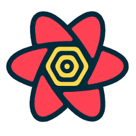

# Notionary 

---

>개인의 노션(Notion) 워크스페이스를 공유하고, 게시글을 통해 다양한 고민을 커뮤니티의 힘으로 해결하는 웹 플랫폼

## 배포 주소  
**[https://notionarys.store](https://notionarys.store)**

## 목차
- [프로젝트 소개](#프로젝트-소개)
- [화면 구성](#화면-구성)
- [메인 페이지](#메인-페이지)
- [추가 페이지](#추가-페이지)
- [수정 페이지](#수정-페이지)
- [주요 기능](#️주요-기능)
- [담당 기능](#️담당-기능)
- [개발 기간](#️개발-기간)
- [팀원소개](#️팀원소개)
- [기술 스택](#기술-스택)
- [협업 도구](#협업-도구)
- [실행 방법](#실행-방법)
- [이슈 상황](#이슈-상황)
- [개선 방향](#개선-방향)
- [향후 확장 방향](#향후-확장-방향)
- [느낀 점](#느낀-점)
---

## 프로젝트 소개
"Notionary"는 사용자가 게시글을 작성하며 자신의 지식, 경험, 또는 고민을 공유하고, 필요하다면 노션 워크스페이스를 선택적으로 함께 공유할 수 있는 커뮤니티 기반 웹사이트입니다. 사용자들은 서로의 게시글과 워크스페이스를 통해 다양한 아이디어를 얻고, 문제 해결을 위한 지혜를 나눌 수 있습니다. 특히, 어려운 고민이 있을 때 커뮤니티의 집단 지성을 활용하여 해결책을 모색하는 것이 Notionary의 핵심 가치입니다.

---

## 화면 구성

### 메인 페이지

#### 게시글 목록

#### 카테고리 조회

#### 댓글 기능

#### 좋아요 기능

- 공유된 워크스페이스 및 게시글 목록
- 카테고리별 탐색
- 댓글 및 좋아요 기능

---

## 추가 페이지

#### 게시글 추가

#### 워크스페이스 공유

- 카테고리별 게시글 추가
- 워크스페이스 첨부 (선택 사항)
- 미디어 파일 첨부

---

## 수정 페이지

#### 수정 기능

- 게시글 내용 수정 (워크 스페이스 미포함)

---

## 주요 기능

- 노션처럼 개인이 작성할 수 있는 워크스페이스 기능
- 게시글의 좋아요 및 댓글 기능
- 게시글에 개인 워크스페이스 첨부 기능 
- 마이페이지에서 사용자가 작성한 게시글 조회 기능

---

## 담당 기능 (이수호)

### 게시글 관련 기능
- 게시글 작성, 수정, 조회 기능 구현 (Frontend + Backend)
- 게시글에 워크스페이스 및 이미지/동영상 등 미디어 첨부 기능 구현
- 게시글 목록 조회 UI 및 상세 페이지 UI 구성
- 게시글 등록 시 카테고리 연동 처리

### 좋아요 기능
- 좋아요 추가 / 삭제 기능 구현
- 좋아요 수 실시간 반영 및 상태별 UI 업데이트

### 댓글 기능
- 댓글 추가 및 조회 API 연동
- 댓글 리스트 렌더링 및 작성 UI 구현

### 카테고리 필터링
- 선택된 카테고리에 따라 게시글 동적 필터링 기능 구현
- 전체/기타/세부 카테고리 API 연동

### 마이페이지
- 로그인된 사용자가 작성한 게시글 목록 조회 기능
- 마이페이지 레이아웃 및 게시글 리스트 렌더링

---

## 개발 기간
* 2025.05.16 ~ 2025.06.1 (총 16일)

---

## 팀원소개
| 팀원 | 역할 | GitHub |
|------|------|--------|
|  |  김민교 | [@Sialsry](https://github.com/Sialsry) |
|  |  비노드 | [@Mr-Binod](https://github.com/Mr-Binod) |
|  |  이수호 | [@susuholee](https://github.com/susuholee) |

---

## API 문서

---

## 기술 스택

- **Frontend**  
 
 
   
  
  
  
  

- **Backend**  

   

- **Database**  

   

---

## 협업 도구

  
  

---

## 이슈 상황

| 번호 | 이슈 내용 |
|------|-----------|
| 1 | 게시글에서 슬라이드 효과로 컨텐츠를 제공하는데, 워크스페이스도 함께 보여주는 UI 구성은 시야 분산으로 인해 사용자 경험이 저하됨|
| 2 | 데이터베이스 모델 중 워크스페이스 관련 테이블에서 필드명(예: workspace_name, workspacectgrs_name, workspacesubctgrs_name)이 유사하여 매핑 및 유지보수가 어려움 |
| 3 | 현재 백엔드에서 req.body로부터 uid(사용자 ID)를 받도록 되어 있어, 인증된 사용자와의 불일치 또는 보안 문제의 가능성이 존재함

---

## 해결 방안

| 문제 | 해결 방법 |
|------|-----------| 
|게시글과 워크스페이스를 슬라이드로 함께 보여주는 UI가 시야를 분산시켜 사용자 경험을 저하함| 사용자 피드백을 더 수집한 후, 레이아웃을 리디자인하거나, 워크스페이스는 클릭 시 별도 팝업 혹은 드롭다운으로 분리하는 방안을 고려 중
|필드명 유사로 인한 매핑 혼란 | 워크스페이스 테이블에 depth 필드를 추가하여 카테고리/서브카테고리를 구분하고, 필드명을 단순화 (workspace_name만 사용)
|사용자 인증 없이 uid를 직접 받아 처리하고 있음|현재는 개발 간편성을 위해 사용 중이지만, 추후 JWT 기반 인증 시스템 도입 예정. 인증 미들웨어를 통해 사용자 정보 추출 및 검증 처리 예정 

---
## 개선 방향

| 항목 | 개선 방향 | 기대 효과 |
|------|------------|------------|
| UI/UX 구성  | 워크스페이스 콘텐츠를 탭 또는 모달 형태로 분리 | 콘텐츠 집중도 향상, 시각 피로도 감소     |
| DB 구조     | `depth` 필드를 도입하고 필드명을 단순화  | 유지보수 편의성 증가, 매핑 명확성 확보    |
| 인증 처리     | JWT 인증 및 미들웨어 도입           | 보안 강화, 사용자 신뢰도 향상         |
| API 명세 관리 | Swagger 기반 명세서를 작성 및 유지    | 팀 간 협업 효율성 향상, API 안정성 증가 |

---
## 향후 확장 방향
| 항목       | 확장 방향                        | 기대 
| -------- | ---------------------------- | ---------------------- |
| 댓글 알림 기능 | 댓글 발생 시 사용자에게 알림 제공          | 커뮤니티 활성화, 사용자 반응성 증가   |
| 실시간 기능   | WebSocket 기반 실시간 좋아요 및 댓글 반영 | 사용자 경험 개선, 즉각적인 피드백 가능 |
| 콘텐츠 추천   | 관심 카테고리 기반 추천 시스템 도입         | 사용자 개인화 경험 제공, 재방문율 증가 |
| 관리자 기능   | 신고 게시글 관리, 유저 모니터링 기능 추가     | 커뮤니티 질 관리 및 운영 효율성 향상  |

## 느낀 점

이번 프로젝트는 처음으로 React를 본격적으로 활용해본 경험이었습니다. React의 컴포넌트 기반 구조와 상태 관리 방식에 익숙해지는 과정에서 많은 시행착오가 있었지만, 이를 통해 프론트엔드 개발의 흐름과 구조적인 사고를 배울 수 있었습니다.

또한 React Query와 Redux도 처음 도입해보았는데, 각각의 역할과 차이점을 프로젝트를 통해 직접 체감할 수 있었습니다. React Query를 통해 비동기 데이터를 효율적으로 관리하고 캐싱 및 리페칭 기능을 적용해보며 서버 상태 관리의 중요성을 배웠고, Redux를 통해 글로벌 상태를 통합적으로 관리하는 방법도 익힐 수 있었습니다.

초기에는 상태 관리 방식에 혼란도 있었지만, 기능을 구현하고 리팩토링해 가며 점차 구조화된 코드를 작성할 수 있게 되었고, 실무에 가까운 경험을 쌓을 수 있었다는 점에서 큰 성장을 느꼈습니다.
기술뿐 아니라 팀원들과 협업하며 UI/UX 개선, API 연동, Git 활용 등의 전반적인 개발 프로세스를 경험할 수 있었고, 다양한 피드백과 문제 해결을 통해 협업의 중요성도 깊이 느낄 수 있었습니다.